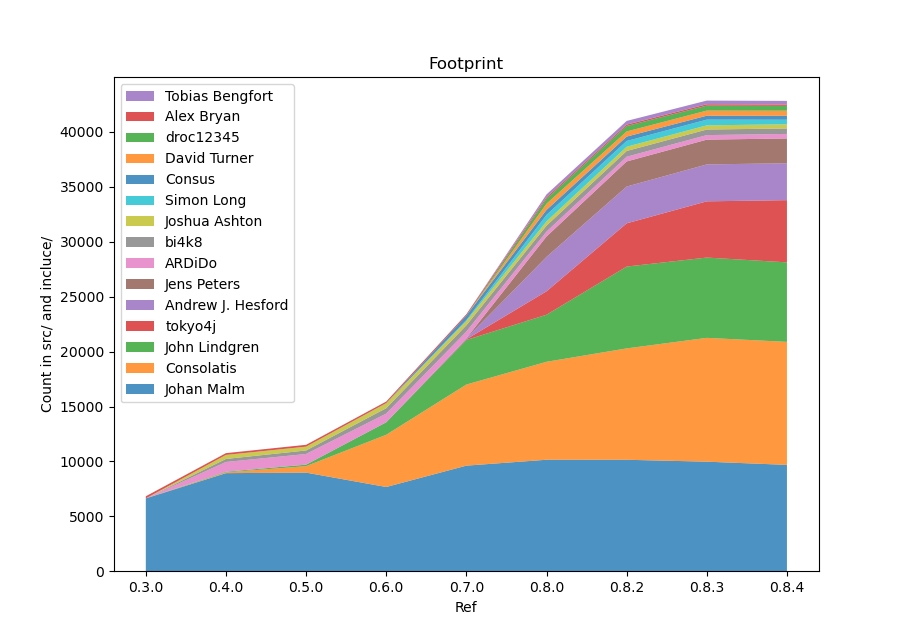

# Footprint

This is just a graph-generator script for git repos to give *one* view of
contributor footprint. It fundamentally counts `git blame` lines, so the
perspective is with emphasis on who last worked on the code rather than other
types of contribution.

We count lines with `git blame -w -C -C -C` where `-w` ignores white-space and
`-C -C -C` detects lines moved or copied in any commit so that it does not
'give credit' for e.g. a moved function.
 
 
